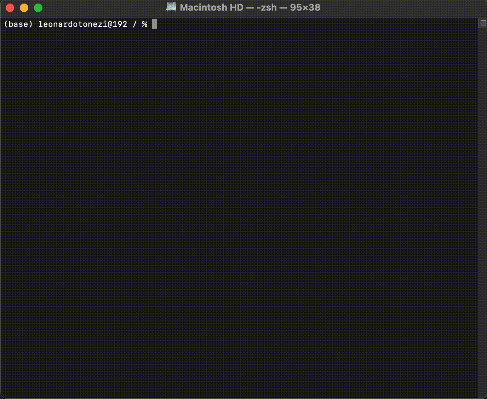

# sandslash

Rust CLI for SEO auditing. Fetches a page, parses the DOM, runs a suite of checks, and emits a scored JSON report.

```
$ sandslash https://example.com -o report.json
```



---

## Install

**From source** (requires Rust stable):

```bash
git clone https://github.com/leotonezi/sandslash
cd sandslash
cargo install --path .
```

---

## Usage

```
sandslash <URL> [OPTIONS]
```

### Options

| Flag | Default | Description |
|---|---|---|
| `<URL>` | — | Target URL to audit |
| `-d, --depth <N>` | `1` | Crawl depth (0 = single page) |
| `-c, --concurrency <N>` | `8` | Concurrent workers |
| `--rate <N>` | `2` | Requests per second per host |
| `--redis-url <URL>` | — | Redis URL for crawl frontier (env: `REDIS_URL`) |
| `--user-agent <UA>` | `sandslash/<version>` | Custom User-Agent |
| `--timeout <secs>` | `30` | Per-request timeout |
| `--max-pages <N>` | — | Cap pages crawled |
| `--global-timeout <secs>` | — | Wall-clock timeout for the entire crawl; returns partial report on expiry |
| `--ignore-robots` | false | Skip robots.txt |
| `--validate-sitemap` | false | HEAD-probe every URL listed in sitemap.xml and flag non-2xx |
| `--check-external-links` | false | Include external links in the broken-link audit |
| `--verbose` | false | Enable verbose tracing output (alias for `RUST_LOG=sandslash=debug`) |
| `-q, --quiet` | false | Print score only |
| `--no-color` | false | Disable colored output |
| `-o, --output <FILE>` | stdout | Write JSON report to file |

### Examples

```bash
# Audit one page, print JSON to stdout
sandslash https://example.com

# Audit one page, write report to file
sandslash https://example.com -o report.json

# Crawl 3 levels deep, 4 workers, cap at 50 pages
sandslash https://example.com -d 3 -c 4 --max-pages 50 -o report.json

# Verbose tracing output
RUST_LOG=sandslash=debug sandslash https://example.com
```

---

## Checks

### Metadata (`weight: 20%`)

| Check ID | Severity | Condition |
|---|---|---|
| `title.missing` | Critical | No `<title>` tag |
| `title.empty` | Critical | Title is blank |
| `title.short` | Warning | Title < 30 characters |
| `title.long` | Warning | Title > 60 characters |
| `description.missing` | Critical | No `<meta name="description">` |
| `description.short` | Warning | Description < 50 characters |
| `description.long` | Warning | Description > 160 characters |
| `canonical.missing` | Warning | No `<link rel="canonical">` |
| `canonical.off-host` | Warning | Canonical points to a different host |
| `canonical.mismatch` | Info | Canonical doesn't match page URL |

### Structure (`weight: 15%`)

| Check ID | Severity | Condition |
|---|---|---|
| `headings.no-h1` | Critical | Page has no `<h1>` |
| `headings.multiple-h1` | Warning | Page has more than one `<h1>` |
| `headings.skipped-level` | Warning | Heading levels skip (e.g. h1 → h3) |
| `headings.empty` | Warning | A heading tag has no text content |

### Security (`weight: 15%`)

| Check ID | Severity | Condition |
|---|---|---|
| `https.insecure` | Critical | Page URL uses `http://` |
| `https.mixed-content` | Warning | `https://` page loads `http://` resources |

### Media (`weight: 10%`)

| Check ID | Severity | Condition |
|---|---|---|
| `images.missing-alt` | Warning | `` has no `alt` attribute |
| `images.empty-alt` | Info | `` on a content image |

### Social Tags (`weight: 5%`)

| Check ID | Severity | Condition |
|---|---|---|
| `og.title.missing` | Info | No `<meta property="og:title">` |
| `og.description.missing` | Info | No `<meta property="og:description">` |
| `og.image.missing` | Info | No `<meta property="og:image">` |
| `og.url.missing` | Info | No `<meta property="og:url">` |
| `twitter.card.missing` | Info | No `<meta name="twitter:card">` |

---

## Scoring

Each page gets a score from 0–100. Each category starts at 100 and findings deduct penalty points (clamped to 0). The page score is the weighted average across categories:

```
page_score = Σ (category_score × category_weight / 100)
site_score = mean(page_scores)
```

| Category | Weight |
|---|---|
| Metadata | 20% |
| Crawlability | 20% |
| Structure | 15% |
| Links | 15% |
| Security | 15% |
| Media | 10% |
| Social Tags | 5% |

---

## Output

JSON report structure:

```json
{
  "root": "https://example.com/",
  "site_score": 87,
  "crawled_at": "2026-05-27T14:00:00Z",
  "pages": [
    {
      "url": "https://example.com/",
      "score": 87,
      "category_scores": {
        "Metadata": 70,
        "Structure": 100,
        "Security": 100,
        "Media": 90,
        "SocialTags": 50,
        "Links": 100,
        "Crawlability": 100
      },
      "findings": [
        {
          "check_id": "title.short",
          "category": "Metadata",
          "severity": "Warning",
          "penalty": 15,
          "message": "Title is 18 chars (min 30)"
        }
      ]
    }
  ]
}
```

---

## Logging

Structured logs via `tracing`. Control verbosity with `RUST_LOG`:

```bash
RUST_LOG=sandslash=info sandslash https://example.com   # default
RUST_LOG=sandslash=debug sandslash https://example.com  # verbose
```

---

## Roadmap

- [x] Phase 0 — Scaffolding (config, CLI, logging)
- [x] Phase 1 — Single-page fetch, parse, audit, JSON output
- [x] Phase 2 — Full auditor suite: redirects, robots.txt, sitemap, colored terminal report
- [x] Phase 3 — Multi-page crawler with Redis frontier, per-host rate limiting
- [x] Phase 4 — Broken-link checker, encoding robustness, progress bar, integration tests, CI

---

## Rust Engineering Notes

Non-obvious problems solved building this — documented with code references:

| Topic | Why it matters |
|---|---|
| [`Send` + `Sync`](docs/rust/02-send-sync.md) | `scraper::Html` is `!Send` — how the async crawler avoids deadlocks |
| [Guards across `.await`](docs/rust/09-guards-across-await.md) | DashMap entry guards + the rate limiter's `Arc` clone pattern |
| [`spawn_blocking`](docs/rust/10-spawn-blocking.md) | Running `!Send` DOM work on the blocking thread pool |
| [Semaphore](docs/rust/11-semaphore.md) | Bounded concurrency for the broken-link checker |
| [Channels & drop-sender](docs/rust/07-channels-mpsc.md) | Worker pool termination without hangs |
| [Error handling](docs/rust/05-error-handling.md) | `thiserror` in lib code, `anyhow` at binary boundary |
| [`Cow<str>`](docs/rust/13-cow-str.md) | `encoding_rs` non-UTF-8 decoding without extra allocations |
| [Trait objects](docs/rust/03-trait-objects.md) | `Box<dyn PageAuditor + Send + Sync>` — fat pointers, vtables, object safety |
| [Ownership & borrowing](docs/rust/01-ownership-borrowing.md) | `Arc` clone vs inner value — when each applies |
| [Tokio spawn](docs/rust/06-tokio-spawn.md) | `'static + Send` bounds and the worker pool design |
| [Consistent hashing](docs/rust/15-consistent-hashing.md) | Modulo vs ring-based host routing — why node changes break `hash % N` |

---

## Development

```bash
cargo build          # debug build
cargo test           # run all tests
cargo clippy         # lint
cargo build --release
```

Tests use `wiremock` for HTTP mocking — no live network required.
